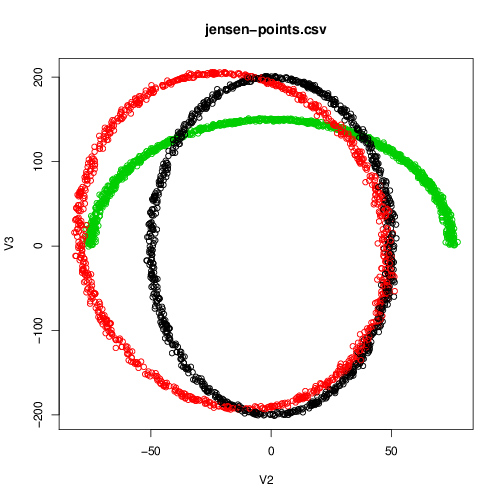
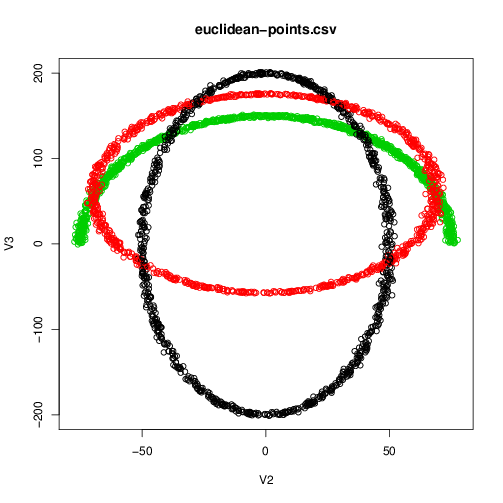
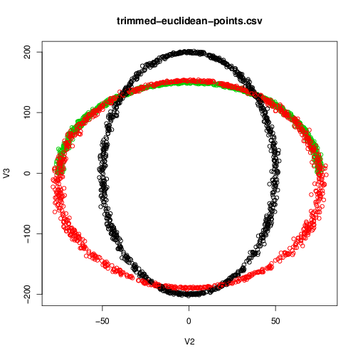

ITKTrimmedPointSetRegistration
=================================

.. image::  https://github.com/InsightSoftwareConsortium/ITKTrimmedPointSetRegistration/actions/workflows/build-test-package.yml/badge.svg
    :target: https://github.com/InsightSoftwareConsortium/ITKTrimmedPointSetRegistration/actions/workflows/build-test-package.yml
    :alt:    Build Status

.. image:: https://img.shields.io/pypi/v/itk-trimmedpointsetregistration.svg
    :target: https://pypi.python.org/pypi/itk-trimmedpointsetregistration
    :alt: PyPI Version

.. image:: https://img.shields.io/badge/License-Apache%202.0-blue.svg
    :target: https://github.com/InsightSoftwareConsortium/ITKTrimmedPointSetRegistration/blob/master/LICENSE)
    :alt: License

Overview
--------

This is a module for trimmed point set registration.

This module provides a trimmed euclidean point set metric that implements a an adaptive trimming of the point set used during the optimization in the registration process: it provides a decorator to the PointSetMetric that overrides the accumulation of the value and derivative computation to use a trimmed number of points.

The itkTrimmedEuclideanDistancePointSetToPointSetMetricv4 is multithreaded and signficantly improves perfromance with the patch https://github.com/InsightSoftwareConsortium/ITK/pull/1037.

Further performance increase can be achieved by subsampling an approximate derivate through SetSamplingRate.

A Simple Example
----------------

Comparing Jensen, Euclidean and trimmed Euclinean metric on 2d toy example

Green - Input target point set

Black - Input source point set

Red -  Transformed source point set

